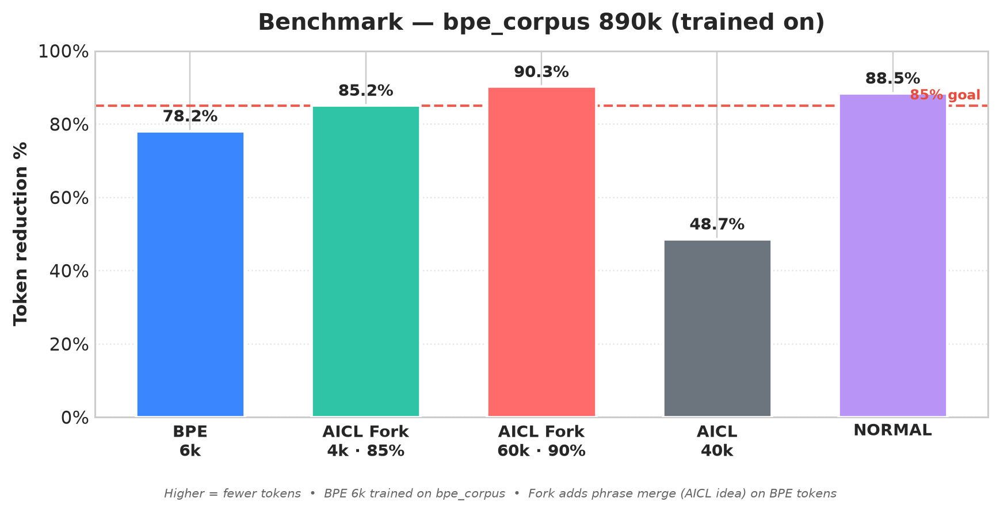

# Debbi — BPE + AICL Fork • 90% Token Reduction

**Debbi** is a 150M (→1B) GPT-style decoder with **BPE + AICL Fork** — BPE does the compression, AICL does the phrase intelligence.

> **AICL** = frequent words/phrases → single Unicode symbol (reversible, `decode(encode(x))==x`)  
> **BPE Fork** = BPE base + AICL phrase merge → **90%** token reduction



*BPE 6k trained on `bpe_corpus` — Fork adds phrase merge (AICL idea) on BPE tokens — Higher = fewer tokens*

The research question:

> Can we beat BPE's 78% with AICL's phrase intelligence?

**Answer: Yes — 85% with 4k phrases (10k vocab), 90% with 60k phrases (66k vocab).**

## Repository layout

```
debbie/
├── README.md, PLAN.md
├── tokenizer/            novel part: AICL encoder/decoder (pure Python)
│   ├── aicl_tokenizer.py      reversible encode/decode, escape- & case-aware
│   ├── train_vocab.py         learn a vocabulary: freq × chars_saved × bonus
│   ├── vocabularies/          saved vocabulary JSONs
│   └── tests/                 roundtrip suite: decode(encode(x)) == x
├── benchmark/
│   └── vs_bpe.py              AICL vs SentencePiece token ratio (honest)
├── data/
│   └── prepare_data.py        text -> corpus.bin (uint16 ids) + id_map.json
├── model/                 standard decoder-only transformer
│   ├── config.py               Debbi-150M defaults
│   ├── transformer.py          RMSNorm + RoPE + SwiGLU, weight-tying, KV-cache gen
│   ├── train.py                bf16/fp16, grad-checkpointing, resumable checkpoints
│   └── generate.py             sample from a checkpoint
└── notebooks/
    └── 01_train_colab.ipynb    end-to-end free-T4 notebook
```

## Quick start

```bash
python -m unittest discover tokenizer/tests      # roundtrip: decode(encode(x)) == x

python tokenizer/train_vocab.py --input data/mycode.txt --output tokenizer/vocabularies/code-vocab.json --size 2000

python benchmark/vs_bpe.py --corpus data/mycode.txt --size 2000

python data/prepare_data.py --input data/mycode.txt --vocab tokenizer/vocabularies/code-vocab.json --out-dir data

python model/train.py --nano --max-steps 50     # CPU smoke test on any machine

python model/train.py                            # Debbi-150M on a T4
python model/generate.py --ckpt checkpoints/debbi-150m/last.pt \
    --vocab tokenizer/vocabularies/code-vocab.json --id-map data/id_map.json \
    --prompt "def quicksort(arr):"
```

### Debbi-150M config (~120M params, fits free T4 comfortably)

| | |
|---|---|
| dim / layers / heads | 768 / 12 / 12 |
| FFN (SwiGLU) | 3072 |
| max seq len | 1024 |
| vocab size | from tokenizer (~4k) |
| dtype | bfloat16 (float16 fallback) |
| memory | ~1.5 GB weights+opt, ~3 GB activations w/ grad-checkpointing |

## The tokenizer, honestly

AICL is a reversible compressor: `decode(encode(x)) == x` always (test suite).
Savings come from replacing a *phrase-with-vocabulary*, *word*, or *char
n-gram* with one Unicode symbol; spaces, newlines, case (↑/⇧), and literal
symbol occurrences are all represented reversibly.

Two things that are **not** claimed:
- “AICL beats BPE by 40–50%” is *unproven* until `vs_bpe.py` measures it on real
  code. Symbols are 1 codepoint = 1 token for Debbi, but stock BPE tokenizers
  can charge rare Unicode symbols 2–4 tokens — hence the benchmark comes first.
- Character compression on prose is often small in practice (see the honest
  percentage numbers `train_vocab.py` prints).

## Training data

`data/prepare_data.py` accepts any local text files (paste code, scraped files,
or use `datasets`/The Stack — see notebook). For the MVP that is enough: the
research value is in the tokenizer comparison, not dataset scale.

## Status

MVP in progress — see PLAN.md. Tokenizer roundtrip suite: green.