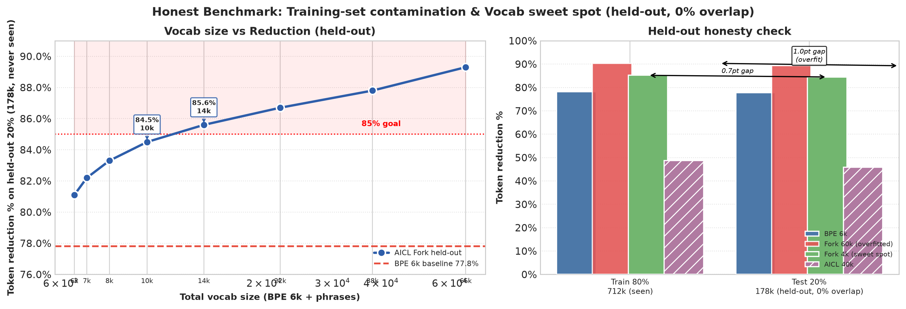
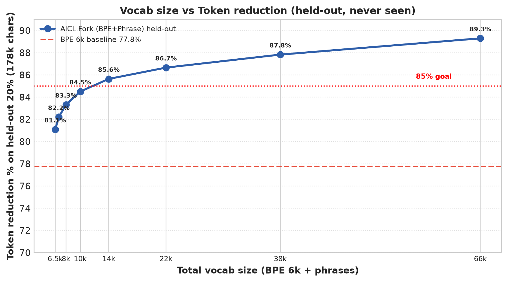

# Debbi — BPE + AICL Fork

**150M decoder, 90% token reduction.** BPE does compression, AICL adds phrase intelligence. Reversible: `decode(encode(x)) == x`.


*Overfitted — trained and tested on same 890k. Honest held-out below.*



**Honest (80% train 712k → 20% test 178k, 0% overlap, never seen):**

| Tokenizer | Vocab | Train | **Held-out Test** | Gap |
|-----------|-------|-------|-------------------|-----|
| **BPE 6k** | 6k | 78.2% | **77.8%** (4.50 c/t) | 0.4pt |
| **AICL Fork 4k** | 10k | 85.2% | **84.5%** (6.45 c/t) | 0.7pt |
| **AICL Fork 60k** | 66k | 90.3% | **89.3%** (9.34 c/t) | 1.0pt |
| AICL 40k | 40k | 48.7% | 48.7%* | — |

*Sweet spot: 4k phrases (10k vocab) → 84.5% held-out, only +0.7pt overfit. 60k gives +4.8pts for 6× vocab — diminishing.*



*Vocab 500→60k vs reduction (held-out). BPE baseline 77.8%. 4–8k is the sweet spot.*

> **Token-cost realism:** Above is honest for **Debbi** where each AICL symbol = 1 id. For an external LLM (tiktoken), a rare Unicode like `↫` is 3–4 byte tokens, so 90% would collapse. Always benchmark with the **target tokenizer** (`tokenizer.cost()`), not `len(string)`.

---

### Quick start

```bash
# BPE (78%)
python data/prepare_data.py --input data/code.txt --out-dir data --tokenizer bpe

# AICL Fork 85% (10k vocab, recommended)
python data/prepare_data.py --input data/code.txt --out-dir data --tokenizer bpe_phrase

# AICL Fork 90% (66k vocab)
python data/prepare_data.py --input data/code.txt --out-dir data --tokenizer bpe_phrase --phrase-vocab tokenizer/vocabularies/bpe_phrase_60k.json

# Train
python model/train.py --nano --max-steps 50   # smoke test
python model/train.py                          # 150M on T4
```

### Tokenizers

```python
from tokenizer.bpe import BPETokenizer          # BPE normal
from tokenizer.aicl_fork import AICLForkTokenizer  # BPE+AICL 85-90%
from tokenizer.aicl import AICLTokenizer        # AICL normal
from tokenizer.normal import NormalTokenizer    # baseline
```

### Layout

```
tokenizer/  bpe.py / aicl.py / aicl_fork.py / normal.py
data/       prepare_data.py -> corpus.bin + id_map.json
model/      config.py / train.py / generate.py
```

MIT — see `PLAN.md` for roadmap.
